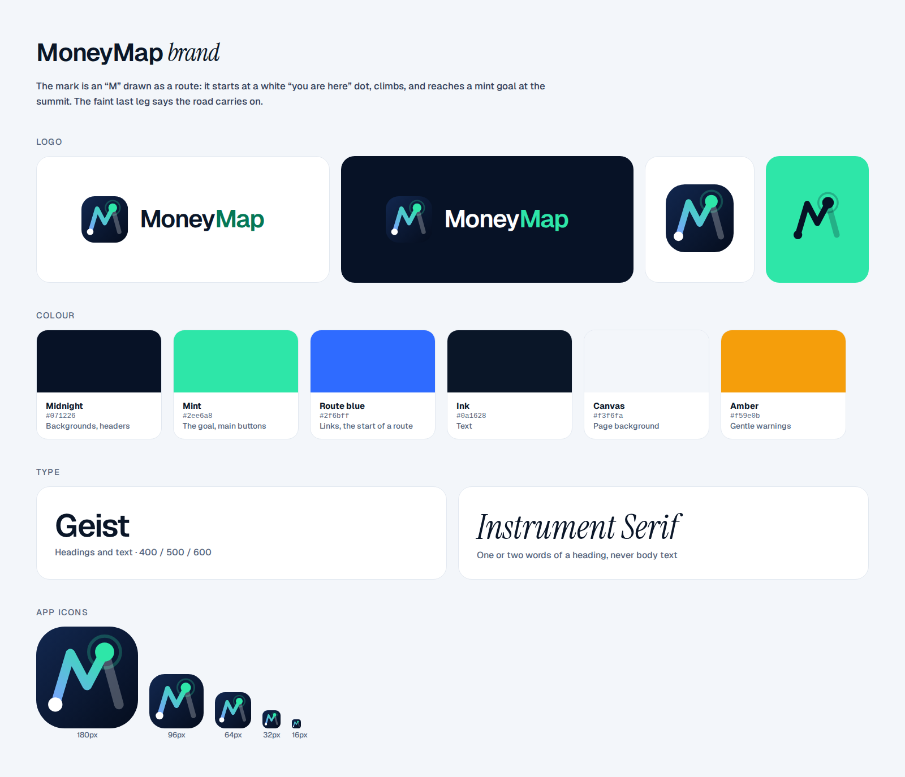

# MoneyMap brand

## The mark

An "M" drawn as a route. It starts at a white **"you are here"** dot, climbs two hills and reaches a **mint goal** at the summit, ringed like a contour line on a map. The last leg of the M is faint, because the road carries on after a goal.

The mark, the route graph in the app and the icons all use the same idea: a start dot, a route and a mint goal.

| File | Use |
|---|---|
| `moneymap-mark.svg` | App icon and avatar. The default. |
| `moneymap-logo-light.svg` / `.png` | Logo with the name, on light backgrounds |
| `moneymap-logo-dark.svg` / `.png` | Logo with the name, on dark backgrounds |
| `moneymap-mark-white.svg` | One colour, on photos or dark colour |
| `moneymap-mark-midnight.svg` | One colour, on mint or light colour |
| `public/favicon.svg`, `favicon-32.png` | Browser tab (the contour ring is left out at this size) |
| `public/apple-touch-icon.png`, `icon-192.png`, `icon-512.png`, `icon-maskable-512.png` | Phone home screens |
| `public/og-image.png` | Link previews (WhatsApp, X, LinkedIn) |

**Do:** keep space around the mark at least the size of the goal dot. Keep it on midnight or white.
**Don't:** stretch it, recolour the route, or add effects.

The SVG logos set the name in Geist. If a tool doesn't have Geist, use the PNG versions.

## Colour

| Name | Hex | Use |
|---|---|---|
| Midnight | `#071226` | Backgrounds, headers, the mark's tile |
| Mint | `#2ee6a8` | The goal, main buttons, icon accents |
| Route blue | `#2f6bff` | Links, the start of a route |
| Ink | `#0a1628` | Text |
| Canvas | `#f3f6fa` | Page background |
| Amber | `#f59e0b` | Gentle warnings |

On white, mint is too light for text. Use green `#047857` for text instead.

## Type

- **Geist** for headings and text (400, 500, 600).
- **Instrument Serif** italic for one or two words of a heading only. Never for body text.
- **Geist Mono** for chart labels and bank statement lines.

## Icons

MoneyMap has its own icon set (`src/components/icons`): a 24px grid, 1.75 stroke and round ends. Most icons carry one mint "route" accent, such as a start dot on every arrow, a goal dot on the pin or a mint check in the shield. On warnings and mint buttons the accent takes the icon's own colour.

## Words

Write the way you'd explain it to a friend:

- Say "money left over", not "surplus". Say "sample data", not "synthetic data".
- One idea per sentence. No banking jargon without a plain explanation.
- Never promise rates, fees or approval. Say "Zenith Bank sets the final terms".

Rebuild every brand file from one drawing with `npm run brand`.
